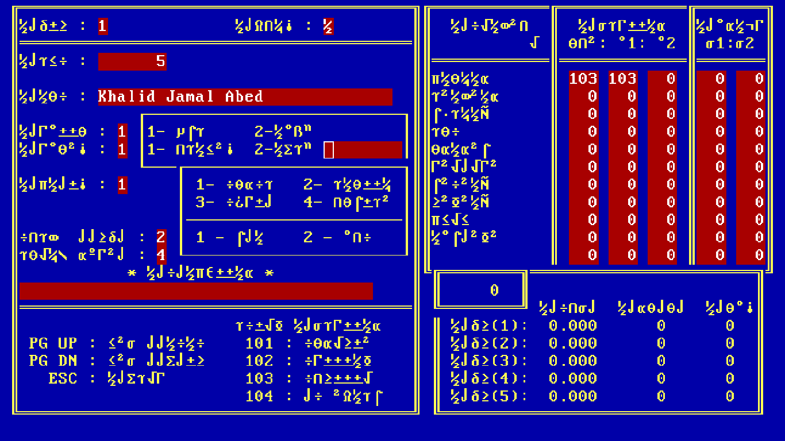

<div align="center">
    
</div>
<h1>DBF to Xlsx</h1>

A program that takes students and subjects database files and converts them to an excel spreadsheet.

## Who is this for?
Well, I made this (by request) for my college to convert their old records to spreadsheet files.
I don't think anyone would make use of this but feel free to take a look!

## Why?
It would've been much easier and a straight-forward process if it was encoded properly.
The records in the database had a non-standard Arabic encoding and required
a special software to decode them. Unfortunately, I didn't have access to that software (the machine that
had it was broken).


So I had to do a lot of guessing to figure out the correct characters. It can be found in `Converter.py`.

## Dependencies
It requires `xlsxwriter` and `PyQt5`.

```
pip3 install xlsxwriter
pip3 install PyQt5
```

## Usage
Run `Main.py`.
```
chmod +x Main.py
./Main.py
```
